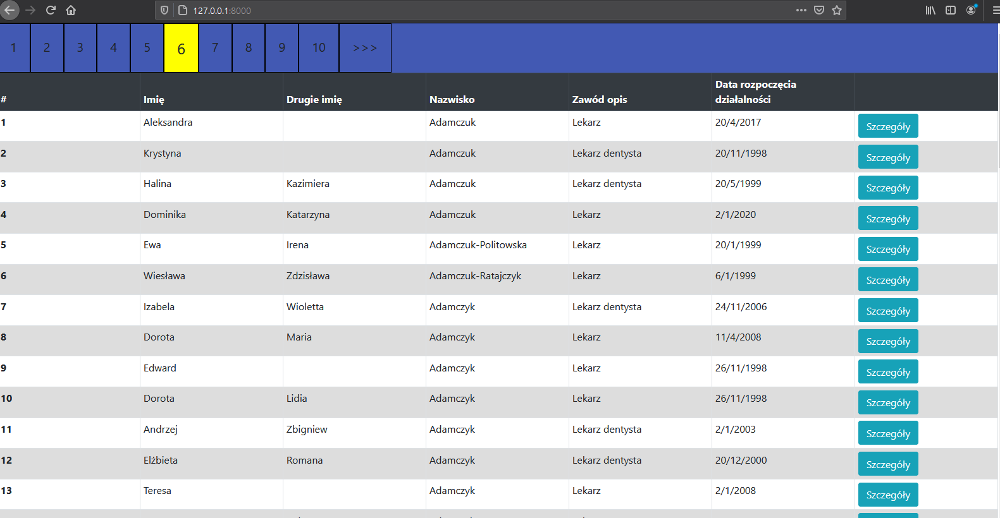
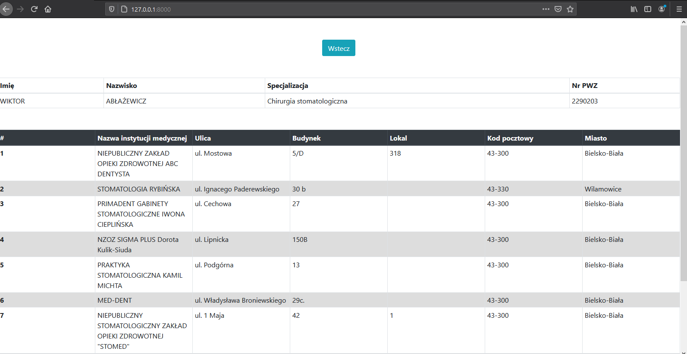
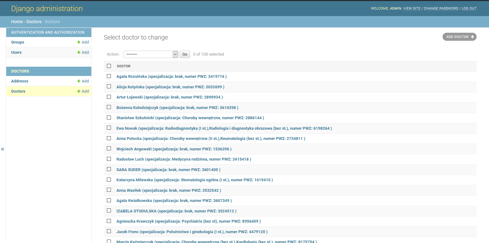

# Doctor and Doctor addresses in Python/Django and React

This is simple application presenting information about doctors and medical institutions on the base of data taken from 'https://rpwdl.ezdrowie.gov.pl/'

## About the project

The project is SPA with Python, Django and Sqlite as backend and React.js in frontend with the use of Webpack and Babel. The content in the application is created dynamically. 
The user is in the same route for whole the time. The data are taken from db by requests prepared in React and handled in Django (in doctors/urls.py and doctors/views.py). In addition it's possible to organise data by entering django admin panel (obviously you need to create superuser by pressing 'python manage.py createsuperuse') where you have all CRUD interface for the data.

**The goal was to:**
- practice backend skills with Python, Django and Sqlite
- practice customizing Django admin page to current needs
- practice frontend skills with React.js
- get familiar with Webpack and Babel
- practice gathering data from csv into db

## Used technologies:
- Python, Django
- Sqlite
- React.js
- Babel, Webpack
- HTML, CSS, Bootstrap
- PyCharm as IDE

## Starting project:
<ol>
    <li>
        Linux -> Run following instructions in the terminal:
        <ul>
            <li>git clone https://github.com/KacperMitkowski/Doctors</li>
            <li>cd Doctors</li>
            <li>python3 -m venv venv</li>
            <li>source venv/bin/activate</li>
            <li>pip install -r requirements.txt</li>
            <li>7z e db_dump_sqlite.7z (in case 7z is not installed you can get it by pressing 'sudo apt-get install p7zip-full')</li>
            <li>cd frontend</li>
            <li>npm install (in case npm is not installed you can get it by pressing 'sudo apt install npm' or 'sudo apt install npm nodejs' )</li>
            <li>cd ..</li>
            <li>python manage.py runserver</li>
        </ul>
    </li>
    <li>
        Windows -> Make following steps in this order:
        <ul>
            <li>
                Run following instructions in Windows CMD
                <ol>
                    <li>git clone https://github.com/KacperMitkowski/Doctors</li>
                    <li>cd Doctors</li>
                    <li>py -m venv venv</li>
                    <li>.\venv\Scripts\activate</li>
                    <li>pip install -r requirements.txt</li>
                </ol>
            </li>
            <li>Then you need to extract db file 'db_dump_sqlite.7z' in the root folder (for example with the zip program)</li>
            <li>   
                Go back to CMD and make following instructions:
                <ol>
                    <li>cd frontend</li>
                    <li>npm install (in case npm is not installed you can download it from here 'https://phoenixnap.com/kb/install-node-js-npm-on-windows')</li>
                    <li>cd ..</li>
                    <li>python manage.py runserver</li>
                </ol>
            </li>
        </ul>
    </li>
</ol>

        
When these steps are finished you press given URL in your browser and you should see the index page of my application.

## Plans for the future:
- add additional functionalities such as: search engine, ordering by pressing column name in index page
- add google maps to display exact location of the doctor's addresses
- connect with GUS / VIES server to get additional data
- refine styles and add RWD rules by implementing more Bootstrap classes
- add external libs to improve UI such as prime.ng
- prepare documentation for other developers

## Screenshots:
Doctors Index page:

Doctor Details page:

Django admin page:

